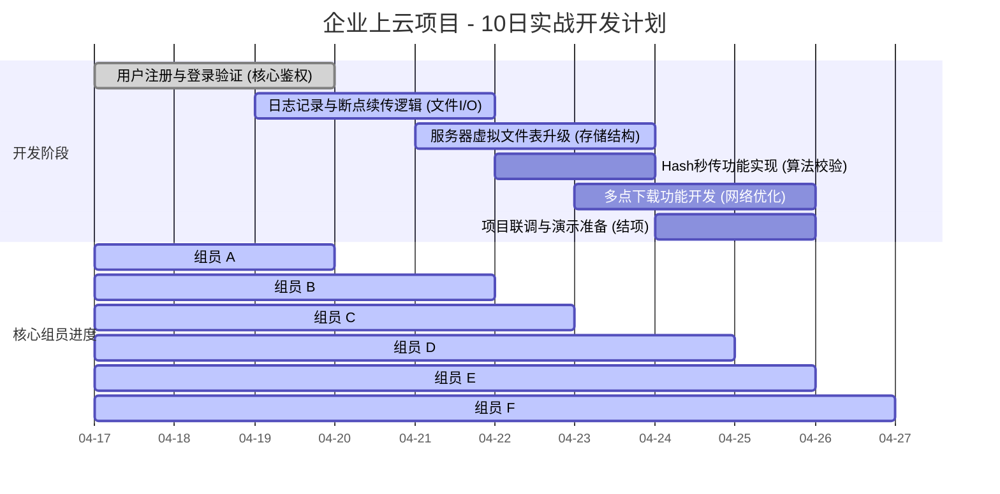

# WindCloud - Linux 企业级云存储系统

> 一个基于 C 语言开发的高性能 Linux 云盘后端系统。本项目采用企业级协作规范，支持秒传、断点续传及虚拟文件系统升级。

## 📅 项目实时进度 (Gantt Chart)




------

## 🚀 项目简介

`WindCloud` 旨在模拟高性能云存储解决方案。通过 C 语言底层编程，实现文件上传下载、目录管理及高效的存储策略。本项目重点解决了海量存储中的**数据去重（秒传）**和不稳定网络环境下的**传输可靠性（断点续传）**。

## 🛠️ 技术栈

- **语言**: C (C99/C11)
- **环境**: Linux (Ubuntu)
- **网络**: 高并发 Epoll 模型, TCP Socket
- **数据库**: MySQL


## 🤝 团队协作与贡献规范 (PR-Only)

为保证代码质量，本项目强制开启 **Branch Rulesets** 保护。

### 1. 开发流程

1. **Sync**: 切换至 `main` 保持最新 `git pull origin main`。
2. **Branch**: 创建特性分支 `git checkout -b feature/your-task`。
3. **Push**: 推送至远程 `git push origin feature/your-task`。
4. **Pull Request**: 发起 PR，并邀请至少 **2位** 组员进行 Review。

### 2. 合并规则 (Squash Merge)

- 本仓库统一采用 **Squash and Merge** 模式。
- 合并时，特性分支的所有 commit 将会被压缩为一个整洁的记录。
- 请确保 PR 描述清晰，合并后的信息将直接作为 `main` 分支的正式变更日志。

## 📂 目录结构


```bash
.
├── src/            # 逻辑代码
├── include/        # 头文件
├── config/         # 配置文件
├── scripts/        # 自动化脚本
├── Makefile        # 构建脚本
└── .gitignore      # 环境过滤配置
```

## ⚙️ 快速上手


```bash
git clone [https://github.com/panlong-studio/WindCloud.git](https://github.com/panlong-studio/WindCloud.git)
make
./bin/server
```
